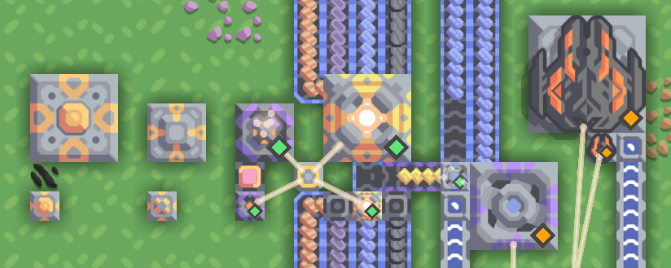

# Tiny Things

This [Mindustry](https://github.com/Anuken/Mindustry/) mod adds smaller versions of various buildings.

Some are perfectly functional, some might seem like a joke gone too far.

  
(left-to-right: core, container, RTG, alloy smelter, T3 drill, Meltdown)

This mod was made for and tested on v7 alpha (136.1).

## Block list

### Production

- **Tiny Surge Smelter**  
  At ~1/8 cost and input/output rate, can produce enough surge alloy for an occasional Surge Tower.  
  At 4 inputs and 1 output on a 1x1 block, it is also an exercise in connecting more than one conveyor per block side.
- **Tiny Disassembler**  
  
- **Tiny Hydro Drill**  
  This little drill can mine Thorium slightly less efficiently than a Laser Drill and without power, but requires water to operate. 
  
### Turrets

- **Tiny Foreshadow**  
  With mere 100 damage per shot and a long cooldown this might not seem like the best turret, but it retains fairly long  range and the signature targeting mechanism.
- **Tiny Meltdown**  
  In a way demonstrates how much you can simplify a sprite while still having it somewhat recognizable.  
  Not particularly well-tested/balanced as of writing this.

### Other

- **Core: Sprout**  
  A small, cheap, low-capacity core.  
  Using it for campaign without extending capacity can be an interesting challenge.
- **Tiny Container**  
  1x1, 50 items, made from copper and lead instead of titanium.
- **Tiny RTG**  
  This one's pretty much just a quarter of a regular RTG but I found it very amusing to make a block that consumes 1 item _per minute_.

## Special thanks

- Dazlezlezle for modifying my core sprite into something that actually reads at low scale
- NullPointerException#7763 and SMOLKEYS for explaining how to use console to mess with block stats without restarting the game.  
  (e.g. `Vars.content.block("tiny-things-tiny-foreshadow").ammoTypes.get(Items.surgeAlloy).trailEffect = Fx.smoke`)
- Everyone that gave feedback on the game's [Discord server](http://discord.gg/mindustry)